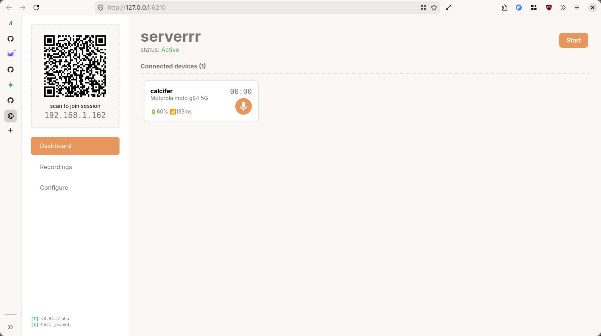
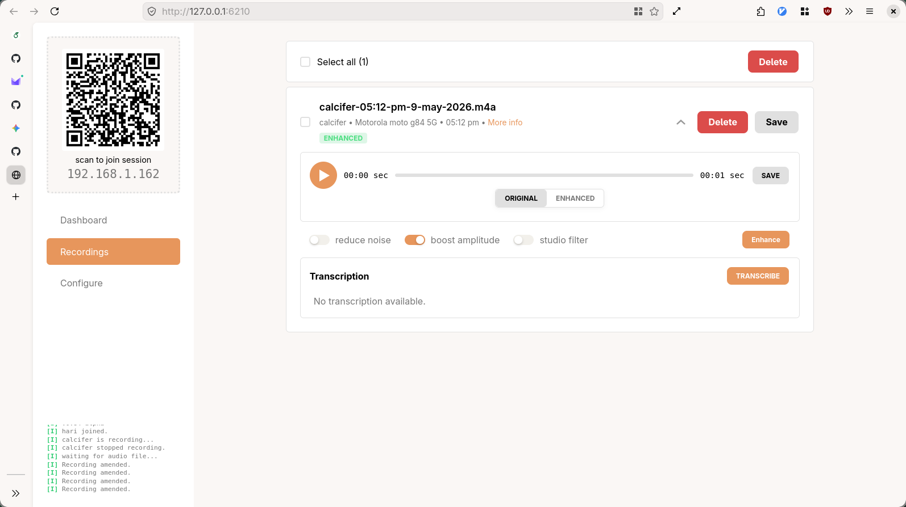
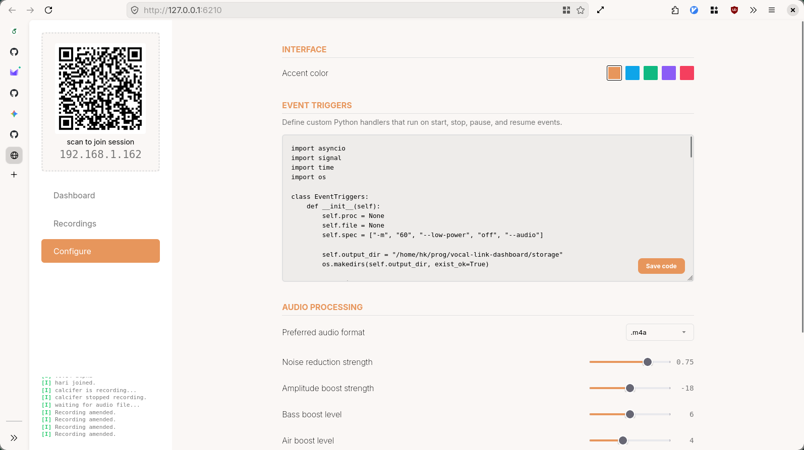

> **fvr-dashboard ~ A controller for [fv-recorder](https://github.com/0x11a41/fv-recorder)**

This dashboard provides a centralized interface to monitor and real-time control over the distributed recording network of smartphones via local network. It allows administrator to track the status of connected devices, provides a global command center to initiate synchronized recorder actions across the entire array and automatically retrieves the audio from each recording node after recording.

## Features
- synchronized controls
- audio enhancement options
- speech transcription (as .srt files)
- custom event triggered scripts

## Screenshots
#### **Main Dashboard**


---

#### **File Management**


---

#### **System Configuration**


## Prerequisites

Before running the project, install:

- python 3.13
- pip
- git
- tsc (optional, required only for debug mode only)
- **IMPORTANT: TCP port - 6210 and UDP port - 5353 must be open.**

## Setup

#### 1. Clone Repository

```bash
git clone https://github.com/0x11a41/vocal-link-dashboard
cd vocal-link-dashboard
```

#### 2. Create Environment

##### Windows

```powershell
python -m venv venv
.\venv\Scripts\activate
pip install -r requirements.txt
```

##### Linux / macOS

```bash
python3 -m venv venv
source venv/bin/activate
pip install -r requirements.txt
```

## Running the server

#### Normal mode

```bash
python app.py
```

#### Running in Debug Mode

you'll need tsc to be installed to open the application in this mode.

```bash
python app.py --debug
```

## Todo

- [x] storing server configuration
- [x] Configure page
- [x] dark and light mode toggle button at top (automatic dark and light theme switching instead)
- [ ] key bindings
- [ ] key bindings documentation
- [x] log section to show toast notifications
- [ ] indicate new recordings
- [x] tooltips

## License

This project is licensed under the MIT License. See the [LICENSE](LICENSE) for details.
